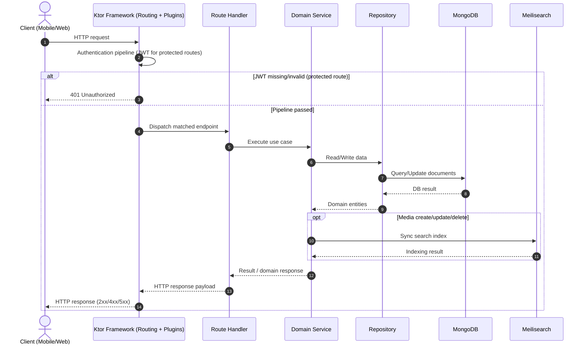
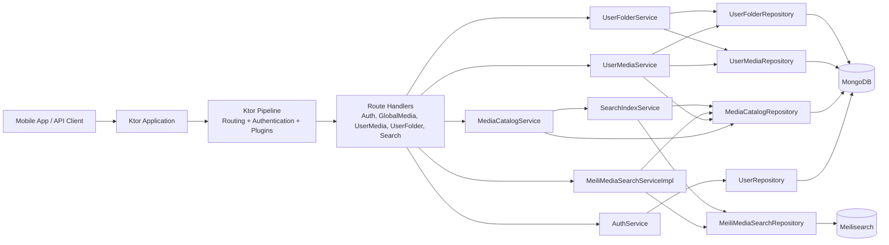
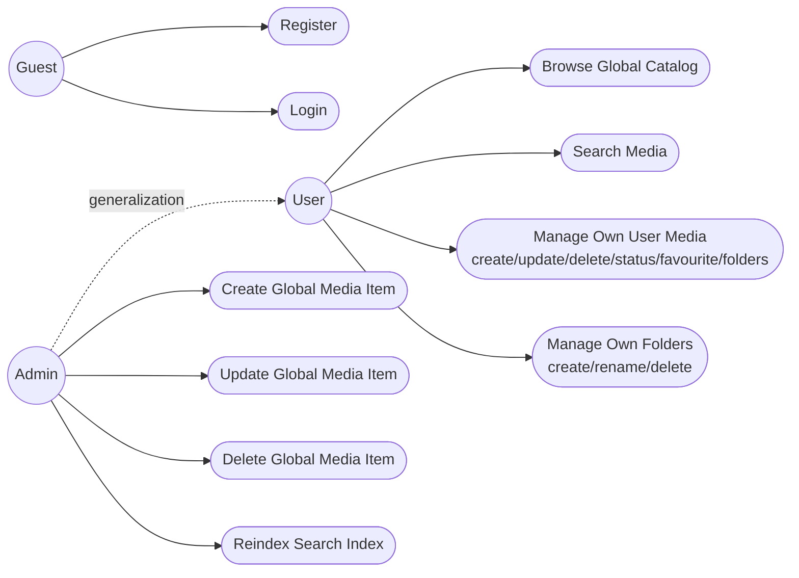

# Listly Backend: UML Flow, Architecture, Use Case

Этот документ собран по актуальному коду backend и подходит для вставки в проектную документацию.

## 1) UML Flow (основной runtime-поток запроса)

## 2) Архитектурная схема (компоненты)

На high-level уровне зависимости между доменными сервисами сведены к минимуму; ключевые связи показаны через repositories.

## 3) Use Case Diagram

## 4) Logical MongoDB Schema

MongoDB используется как document-oriented хранилище; связи моделируются как logical references между документами, а не как SQL PK/FK constraints.

`users`
- `_id`
- `login` (в проекте используется login; при миграции на email индексная стратегия сохраняется)
- `passwordHash`
- `role`

`media`
- `id`
- `title`
- `description`
- `mediaType`
- `mediaStatus`
- `genres`

`user_media`
- `id`
- `userId` -> logical reference to `users._id`
- `mediaId` -> logical reference to `media.id`
- `collectionStatus`
- `isFavourite`
- `folderIds[]` -> logical references to folder identifiers
- `userRating`
- `note`

`folders`
- `id`
- `userId` -> logical reference to `users._id`
- `name`

## 5) п Indexes

`users`
- unique(`login`)  
  если используется email-идентификатор: unique(`email`)

`user_media`
- unique compound index (`userId`, `mediaId`)

`media`
- index(`title`)
- index(`mediaType`)

`folders`
- index(`userId`)

## Замечание по ролям

- `Create Global Media Item` (`POST /media` и alias `POST /mediaCatalog`) должен выполняться только ролью `ADMIN`.
- В коде это зафиксировано через `authenticate("auth-jwt") + requireAdmin(...)`.
