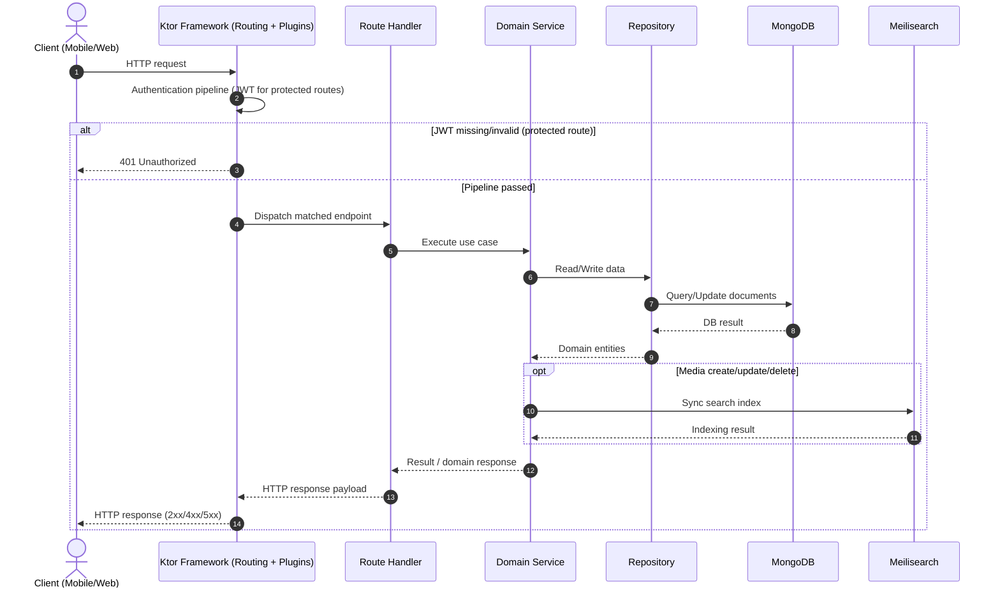

# Runtime Flow (Ktor + JWT)

JWT-проверка выполняется в рамках Ktor pipeline до передачи управления в route handler. Поэтому отказ по авторизации (`401`) формируется на уровне framework-пайплайна, а не в доменном сервисе.

После успешной аутентификации Ktor маршрутизирует запрос в конкретный endpoint, где уже запускается бизнес-сценарий через service-layer. Это отделяет технические проверки доступа от прикладной логики use-case.

Repository-слой инкапсулирует операции чтения/записи в MongoDB и возвращает доменные данные сервисам. За счёт этого маршруты и сервисы не завязаны на детали хранения документов.

Для операций изменения глобального каталога (`create/update/delete`) дополнительно выполняется синхронизация поискового индекса в Meilisearch. Ошибки поиска и ошибки БД в таком потоке диагностируются независимо.
