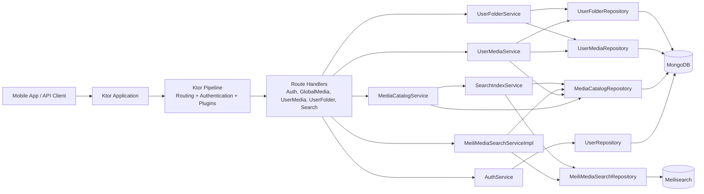

# Architecture Components

На этой high-level схеме Ktor Pipeline выделен отдельно, чтобы показать место, где выполняются routing, authentication и инфраструктурные плагины. Это помогает не смешивать framework-поведение с прикладными сервисами.

Routes выступают точкой входа в доменную логику и делегируют операции в специализированные сервисы (`AuthService`, `MediaCatalogService`, `UserMediaService`, `UserFolderService`, `SearchService`). Каждый сервис покрывает свой bounded context.

Зависимости сервисов преимущественно показаны через repositories, чтобы снизить прямую связность между сервисами на архитектурном уровне. Такой вид диаграммы лучше отражает стабильный контракт данных и упрощает эволюцию бизнес-логики.

Поиск и индексация вынесены в отдельные компоненты (`MeiliMediaSearchRepository`, `SearchIndexService`) с отдельным внешним хранилищем Meilisearch. MongoDB остаётся источником истины для доменных документов, а поисковый индекс — оптимизированным read-механизмом.
