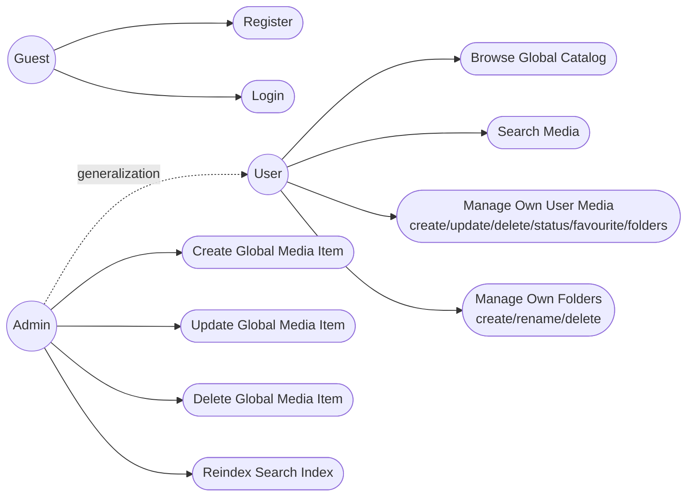

# Use Case Diagram

Диаграмма разделяет три актора: `Guest`, `User` и `Admin`. `Guest` ограничен регистрацией и входом, после аутентификации сценарии переходят в пользовательский контур: просмотр каталога, поиск, управление личной коллекцией и папками.

Связь generalization (`Admin` -> `User`) фиксирует, что администратор включает все пользовательские сценарии и дополнительно выполняет операции уровня системы: создание/обновление/удаление глобальных media-записей и переиндексацию поиска. Такое разделение напрямую поддерживает role-based access policy backend (`USER` vs `ADMIN`).
